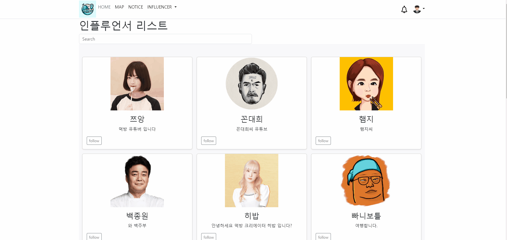
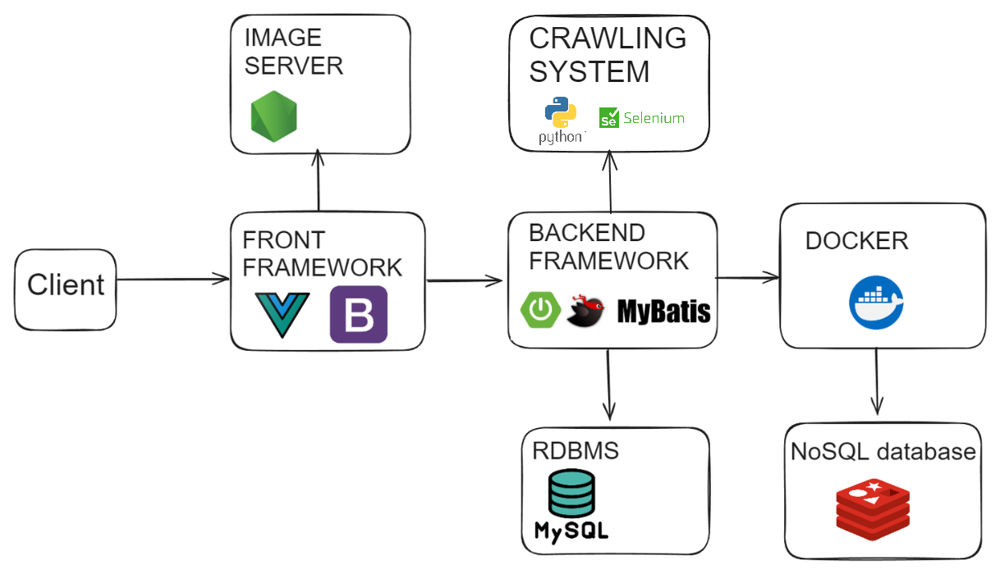

# InspiTrip

| 항목      | 내용                                                                                                                                              |
| --------- | ------------------------------------------------------------------------------------------------------------------------------------------------- |
| 기간      | 2024.05.12 ~ 2024.05.23                                                                                                                           |
| 인원      | 2명                                                                                                                                               |
| 사용 기술 | SpringBoot, MyBatis, Vue3, Bootstrap5, Redis, Docker, Node.js (Express), Python, Selenium                                                         |
| 담당 역할 | 백엔드 개발, 프론트엔드 개발, 크롤링 모듈 구현                                                                                                    |
| 개요      | 인플루언서와 관광지 정보를 한눈에 볼 수 있는 서비스 제공. 인플루언서 방문 기록과 관광지 정보를 결합하여 사용자에게 유용한 정보를 전달하는 플랫폼. |

---

## 1. 프로젝트 개요

### 배경 및 목표

최근 유튜브 채널 및 인플루언서들이 다양한 관광지와 가게를 방문하는 컨텐츠가 증가하면서, 사람들이 이들의 방문 정보를 궁금해하게 되었습니다.  
이에 따라, 관광지와 인플루언서 방문 기록을 한눈에 볼 수 있는 통합 서비스를 구축하여 사용자에게 쉽고 편리하게 정보를 제공하는 것을 목표로 기획하였습니다.  
또한, 인플루언서 랭킹 기능을 도입하여 사용자들이 인기 인플루언서를 쉽게 확인할 수 있도록 하였습니다.

---

## 2. 주요 기능

### 메인 페이지

-   **인플루언서 랭킹**: 실시간 랭킹 시스템을 통해 인기 인플루언서 순위 제공.
-   **관광지 이미지 랜덤 표시**: 실제 서비스에 사용되는 관광지 이미지 중 일부를 무작위로 보여줌.
-   **공지 게시판**: 최신 공지사항을 3개까지 노출하며, 클릭 시 해당 게시글로 이동 가능.

### 회원(맴버) 기능

-   **회원가입**: 글자수 제한 및 중복 아이디 체크 기능 포함.
-   **로그인**: JWT 토큰 기반 인증 시스템 구현.
-   **회원 정보 관리**: 회원 정보 조회 및 수정 기능 제공.
-   **세션 관리**: JWT 만료 시 알림 후 로그아웃 처리.

### 게시판(QNA) 기능

-   **게시글 관리**: 게시글 등록, 페이징 처리, 조회, 수정 및 삭제 기능 구현.
-   **공지 추가**: 관리자 계정으로 로그인 시 공지사항 추가 기능과 이미지 첨부 가능.

### 지도 페이지

-   **지도 기반 검색**: 드래그를 통한 지역 선택 및 중앙 기준 관광지 정보 업데이트.
-   **필터링 기능**: 음식점, 관광지 등 분류별 필터링과 시/구/군 검색 제공.
-   **클러스터링**: 확대 시 마커 클러스터링 지원.
-   **카드 리스트 및 상세 정보**: 무한 스크롤을 통한 카드 리스트 제공, 마커 및 카드 클릭 시 상세 정보 확인.
-   **인플루언서 정보**: 방문한 관광지 및 인플루언서 마커 표시, 팔로우/검색 기능 제공.
-   **방문 영상 정보**: 인플루언서가 방문한 관광지에 대한 영상 정보 제공.

### 인플루언서 기능

-   **인플루언서 목록 및 검색**: 인플루언서 리스트, 검색, 팔로우 기능 제공.
-   **인플루언서 추가 요청**: 사용자가 직접 인플루언서 추가 요청을 할 수 있으며, 관리자 승인/거절 처리 기능 포함.

### 업로드 알람 기능

-   **실시간 알람**: 팔로우한 인플루언서의 새로운 방문 정보가 등록될 경우 알람 전송.
-   **알람 관리**: 알람 읽음 처리 및 삭제 기능, 클릭 시 해당 방문 정보 페이지 연결.

### 리뷰 기능

-   **관광지 리뷰 작성**: 리뷰 작성 시 이미지 첨부 및 평점 기능 제공.

---

## 3. 나의 기여

### 백엔드 개발

-   SpringBoot 기반의 백엔드 시스템 구축, MyBatis를 통한 RDBMS와의 데이터 매핑 구현.

### 프론트엔드 개발

-   Vue3 및 Bootstrap5를 이용한 SPA(싱글 페이지 어플리케이션) 개발.
-   게시판 기능 및 회원 페이지 구현

### 데이터 수집

-   Python과 Selenium을 활용하여 유튜브 영상의 스크립트를 추출한 뒤 GPT3.5 API를 이용하여 스크립트 속에서 장소명, 위치 정보를 추출.
-   수집한 데이터의 위치명, 장소명을 조합하여 네이버 블로그 검색 api로 검색, 검색 결과로 나온 10개의 블로그 안의 지도 정보를 추출, 추출한 10개의 정보에서 빈도수(최소 5개 이상)가 가장 많이 나온 1개의 위치 정보를 특정하여 장소 정보를 데이터베이스에 저장.

---

## 4. 결론

이번 프로젝트를 통해 다양한 기술 스택의 통합 활용 경험을 쌓았으며, 인플루언서와 관광지 정보를 결합한 사용자 친화적인 플랫폼을 성공적으로 구축하였습니다.  
이를 통해 사용자들이 쉽고 편리하게 관심 있는 정보를 얻을 수 있는 서비스 제공의 가능성을 확인할 수 있었습니다.

---

## 5. 배운점

-   **기술 스택 통합 관리**: SpringBoot, Vue3 등 다양한 기술의 효율적인 연계 방법 학습.
-   **인증 및 보안**: JWT 기반 인증 시스템 및 세션 관리 구현 경험.
-   **데이터 크롤링**: Python과 Selenium을 활용한 데이터 자동화 및 크롤링 기술 습득.
-   **UI/UX 개선**: 사용자 중심의 인터페이스 설계와 무한 스크롤, 클러스터링 등 지도 기반 서비스 구현 경험.
-   **프로젝트 관리**: 제한된 기간 내에 다수의 기능을 통합하고 안정적으로 배포하는 방법에 대해 배움.

## 6. 설계

### 아키텍처

### 데이터베이스

